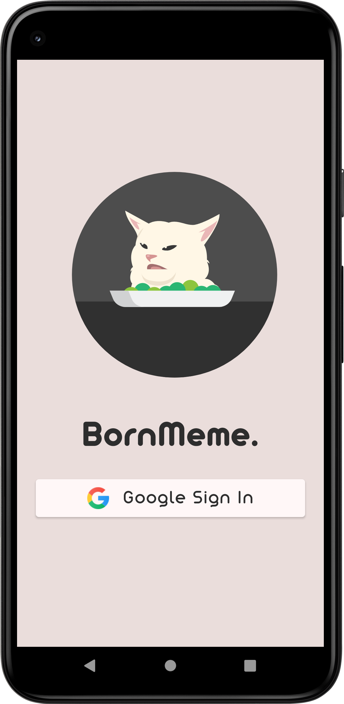
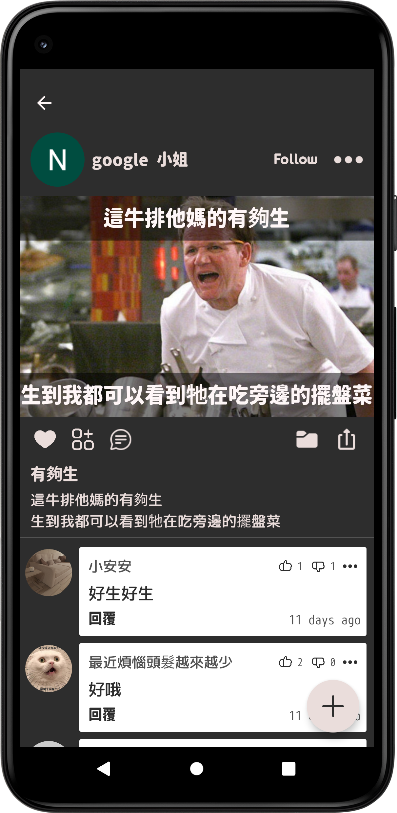
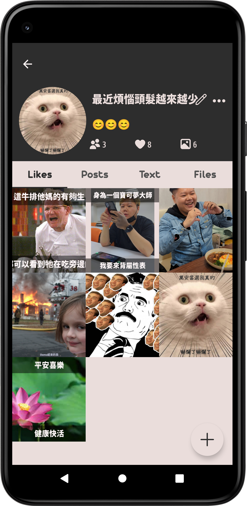
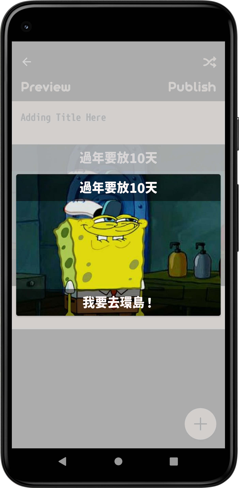

## **BornMeme. 播種迷因**
   
 
**一款快速製作梗圖，可以跟朋友分享創作的平台** 
 

#### **功能介紹**
* 分享發布
  - 平台可透過Google帳號登入
  - 以瀑布流的畫面呈現每則貼文
  - 以標籤方式篩選有興趣的主題  
    &nbsp;&nbsp;&nbsp;&nbsp;  
  
* 社群互動
  - 與其他使用者留言互動
  - 與其他使用者互相追蹤封鎖
  - 查看其他使用者創作記錄  
  &nbsp;&nbsp;&nbsp;&nbsp;  
* 梗圖鍵盤
  - 透過設定變更系統鍵盤可選擇梗圖鍵盤
  - 梗圖鍵盤可設置自己創作的迷因做為發送內容  
  &nbsp;&nbsp;&nbsp;&nbsp;  

* 編輯預覽
  - 兩種編輯方式
  - 固定模式為上下兩排文字輸入框
  - 客製模式為文字框隨意拖曳、增加，可以新增內建圖庫的貼紙
  - 透過預覽可了解發佈至平台的狀態是否符合預期  
  &nbsp;&nbsp;&nbsp;&nbsp;  
#### **開發環境**
* Android Studio Chipmunk | 2021.2.1 Patch 1
* Android SDK: 32
* Gradle: 7.1.2
#### **套件工具**
* [Glide](https://github.com/bumptech/glide)
* [Lottie](https://github.com/airbnb/lottie-android)
* [Dexter](https://github.com/Karumi/Dexter)
* [Circleindicator](https://github.com/ongakuer/CircleIndicator)
* [Timber](https://github.com/JakeWharton/timber)
* [ktlint](https://github.com/prolificinteractive/material-calendarview)
#### **聯絡資訊**
* Beva : bevalin09@gmail.com 
* 
